# DCA research — master report: lump sum vs DCA, oracles & dip rules, money-market cushions

Run date: 2026-09-17. Data: Yahoo total-return daily bars (dividends reinvested like
accumulation ETFs), 2004-11-18 → 2026-09-16, 5,490 common trading days. Costs: 10 bps
commission + 5 bps slippage per ETF leg, fills at close, annual rebalance, fractional
shares, no TER/taxes. Waiting cash earns the ^IRX T-bill yield (simple y/360 per
calendar day) — the stand-in for a XEON/conto-deposito money-market fund.

**Window scheme** (all studies): 498 windows per portfolio = horizons
{10, 12, 14, 16, 18, 20}y × every monthly start 2004-12 → 2026-08.

| Horizon | 10y | 12y | 14y | 16y | 18y | 20y |
|---|---:|---:|---:|---:|---:|---:|
| windows | 143 | 119 | 95 | 71 | 47 | 23 |

**Portfolios**: 100% stocks (55% SPY / 30% EFA / 15% EEM) · 80/20 · 60/40 ·
Golden Butterfly (20% VTV / VBR / SHY / GLD + 20% cash sleeve).

Underlying studies (full detail): `dca_vs_lumpsum.md` · `dip_dca.md` · `mm_cushion.md` —
this report is the consolidated read with all comparisons side by side.

---

## 1. Lump sum vs DCA (identical invested amounts)

Every strategy invests exactly X = 500 × months of the window; only deployment
timing differs. Jan 2004-12 → 2026-08, 498 windows × 4 portfolios = 1,992 sims per
strategy; oracle rows use perfect hindsight (upper bounds, not tradable).

### 1.1 Headline pooled results

| Strategy | median terminal | mean | p5 | p95 | win vs LS | adv vs LS (med) |
|---|---:|---:|---:|---:|---:|---:|
| **lump_sum** | **190,301** | **219,131** | 100,928 | 449,240 | — | **+45.0%** vs DCA |
| dca_mid (500/mo mid-month) | 126,905 | 144,490 | 80,164 | 267,608 | 0.5% | -31.0% |
| oracle_1m (hindsight monthly low) | 129,874 | 148,165 | 81,615 | 275,009 | 0.9% | -29.5% |
| oracle_pt_3m / pt_6m | 134,718 | 154,166 | 83,781 | 287,886 | 2.2% | -27.1% |
| oracle_cy_3m / cy_6m | 136,562 | 156,291 | 84,809 | 290,315 | 2.5% | -26.1% |

### 1.2 The four pictures that tell the story

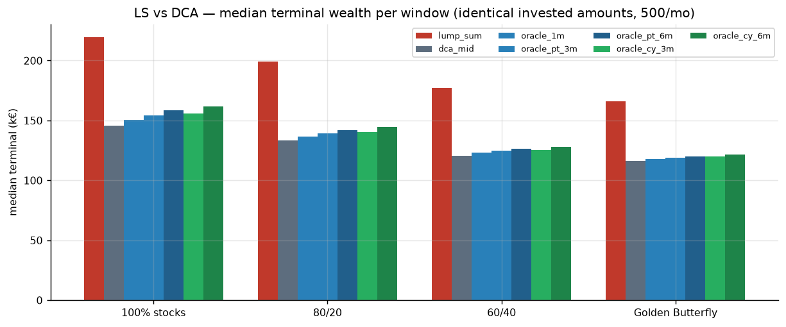

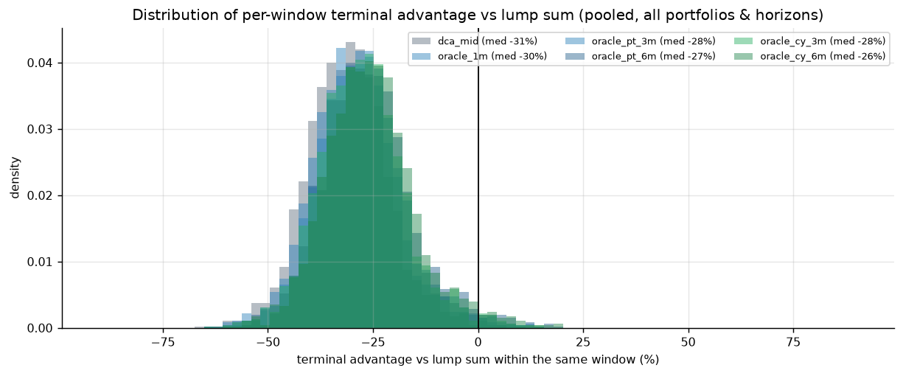

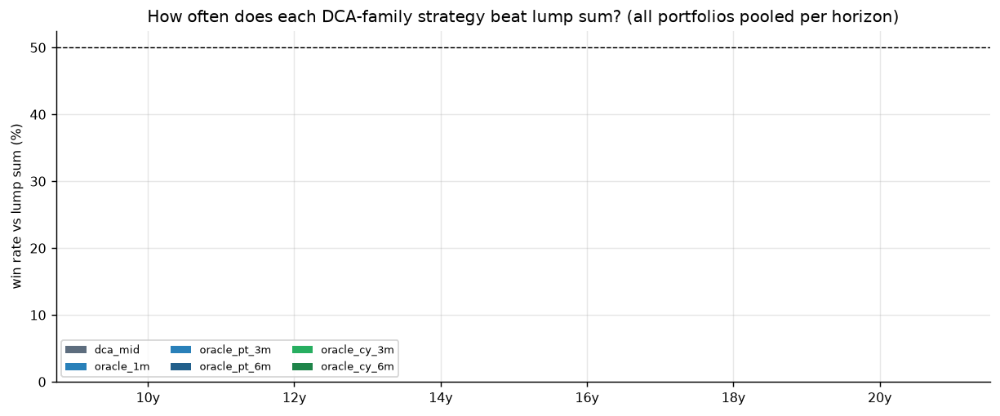

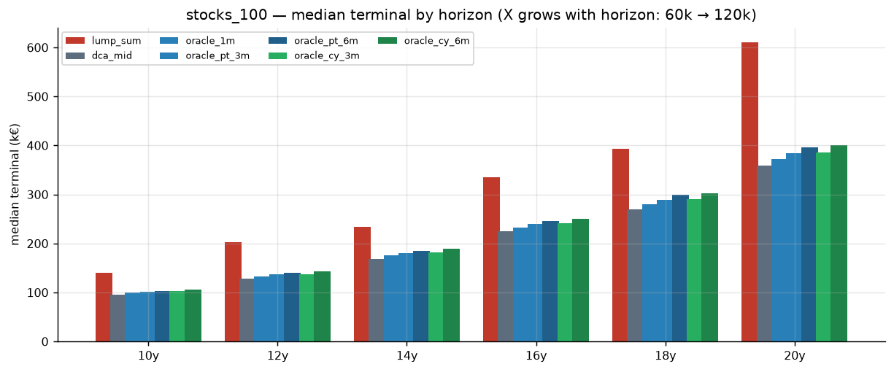

Reading of the distribution plot: every DCA variant sits in one broad negative band
(median ≈ −26 to −31% vs LS) — the right tail where DCA wins (deep bear markets at
the start of a window) is a small, thin shoulder, not a mode. The gap narrows for the
worst starting markets (2008-07 anchor: DCA trails by "only" −12%).

**Takeaway**: lump sum wins ~98-99% of windows; no DCA timing variant with matched
capital changes that. DCA's average tranche spends roughly half as long in the
market as LS money.

---

## 2. DCA vs oracle DCA + implementable dip rules

Question: how much does *perfect* dip knowledge add to naive DCA, and how much of
that can an implementable rule capture? Per-EUR comparisons normalize for capital
(dip variants deploy extra capital by design).

### 2.1 Pooled per-EUR timing edges vs naive mid-month DCA (baseline = 1.0)

| Family | Strategy | Edge (med) | Edge (mean) | Extra capital (median) |
|---|---|---:|---:|---:|
| hindsight | oracle_1m (~+ monthly low) | **+2.3%** | +2.4% | — |
| hindsight | oracle_pt_3m / pt_6m (patience) | +4.3% / +6.1% | +4.5% / +6.4% | — |
| hindsight | oracle_cy_3m / cy_6m (lumps) | +4.8% / **+7.5%** | +5.0% / +7.8% | — |
| implementable | dip_shift (vs v1 trigger) | +0.0% | +0.0% | — |
| implementable | dip_double_v1 (2x, no haircut) | +0.6% | +0.6% | +80% |
| implementable | **dip2x_half** (2x; half next month) | **+1.7%** | +1.5% | +45% |
| implementable | dip2x_5pct15d (−5%/15d trigger) | +1.6% | **+1.8%** | +24% |
| implementable | dip2x_consec2 (2 red running-lows) | +1.4% | +1.3% | +27% |
| implementable | dip6m_deep (cycle lumps, budget-neutral) | **−0.3%** | −0.4% | — |

### 2.2 Pure-stock portfolio scaling (stocks_100)

| Strategy | EUReur edge (stocks) | pooled |
|---|---:|---:|
| dip2x_half | +2.0% | +1.7% |
| dip2x_5pct15d | **+3.4%** (mean +3.1%) | +1.6% |
| dip6m_deep | −0.5% | −0.3% |
| oracle_1m → oracle_cy_6m | +3.5% → +11.2% | +2.3% → +7.5% |

### 2.3 Why implementable triggers are hard (diagnostics)

- The v1 rule ("red + monthly running low") fires in **85% of months** (83% of
  firings in the first 3 days of the month — mostly just the month's open).
- Adding the −3%-below-20-day-high gate cuts firings to ~50% (stocks) and roughly
  **triples the skill** (+0.6% → +1.7% per EUR). Going deeper (−5%/15d) does not
  add skill — it just trades frequency for depth at the same ~+1.6%.
- The 6-month cycle version (budget-neutral, waits for cycle lows) is a small
  **negative** (−0.3%): without hindsight you buy inside persistent downtrends.

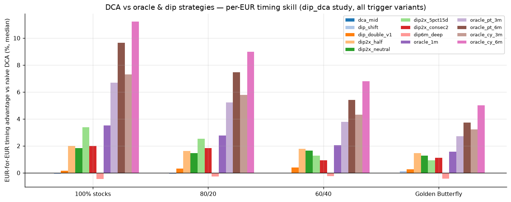

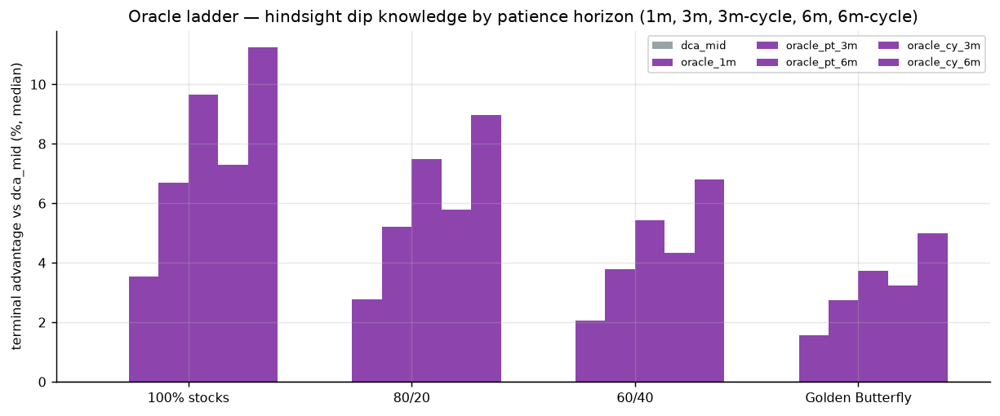

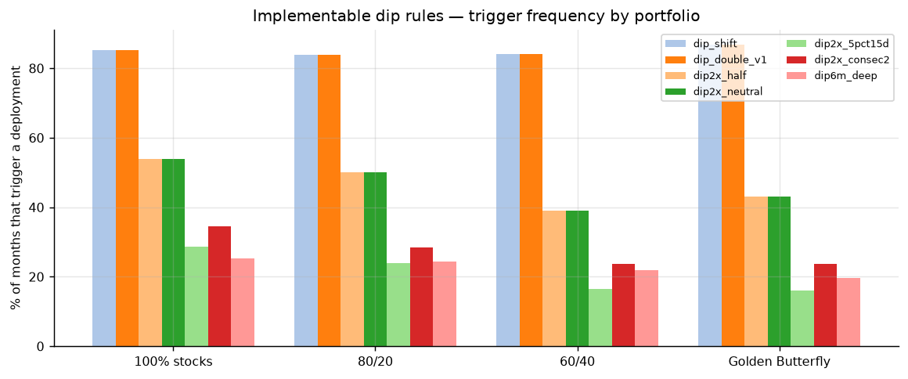

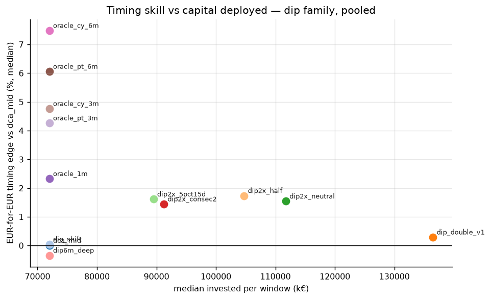

**Takeaway**: perfect foresight of monthly lows is worth +2.3% (+3.5% pure stocks);
the best implementable trigger gets you ~2/3 of that (+1.7-3.4%); waiting for
6-month cycle lows without foresight actually *loses* money. Timing is a rounding
error next to the LS-vs-DCA gap (−31%) and the cushion question (next section).

---

## 3. Money-market cushion: 30k reserve + 500/mo, four policies

**Budget equality**: all four approaches commit the identical pools — 30k at start
(the reserve/XEON bucket) + the 500/month income stream. Only allocation differs.

| Approach | Rule | Equities get | MMF leftover (med) |
|---|---|---|---:|
| 1. lump_sum_30k | reserve invested at day 0 + 500s on arrival | 30k + 500×N | 0 |
| 2. dca_cushion | 500/mo + 30k untouched in MMF | 500×N | 34,524 |
| 3. oracle_cushion | as (2), month's lowest-close buys | 500×N | 34,524 |
| 4. dip2x_mm | 500/mo; 2x (1000) when red + ≥3% below the previous-30-day high + first 2 weeks of the month — extra 500 **withdrawn from the reserve** | 500×N + draws | ~5k |

### 3.1 Results (pooled, median total = portfolio + MMF leftover)

| Strategy | median total | vs lump sum | vs parked DCA (2) |
|---|---:|---:|---:|
| lump_sum_30k | **201,750** | — | +25.5% |
| dca_cushion | 160,801 | -18.0% | baseline |
| oracle_cushion | 163,838 | -16.5% | +1.9% |
| dip2x_mm | 179,094 | **-9.8%** | **+11.3%** |

Per portfolio — dip2x_mm vs parked cushion (same budget, only the reserve
treatment differs): **+17.1%** (stocks_100) · +12.8% (80/20) · +6.8% (60/40) ·
+6.0% (GB). Trigger rates 29-41% of months; the reserve is ~85-97% consumed by
window end. GFC anchor (2008-07, 10y): dip2x_mm 156.7k ≈ lump_sum 158.6k (−1.2%),
parked cushion 132.1k (−16.6%).

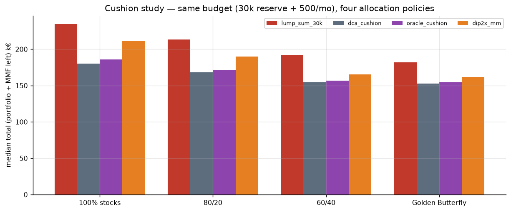

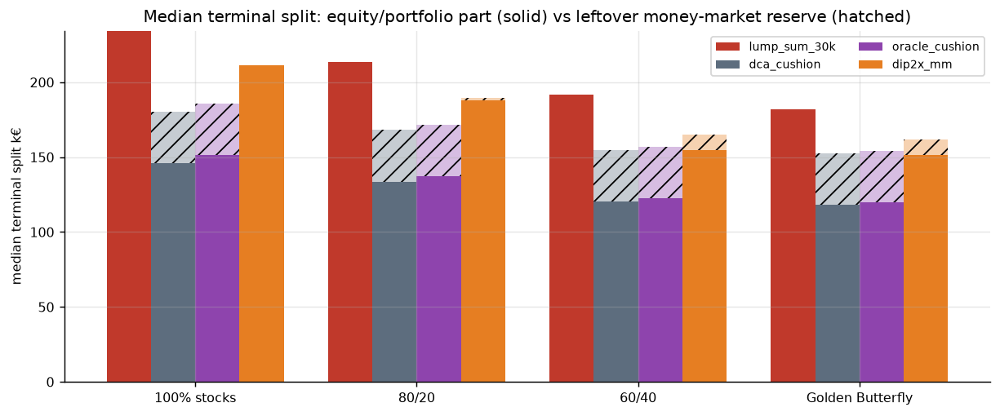

**Takeaway**: a permanently parked 30k buffer costs 16-18% of terminal wealth at
this savings scale. Harvesting it into equities on dip days recovers about half
the drag — the mechanism is *capital reallocation into drawdowns*, far more
powerful than intra-month timing. But the pure lump-sum deployment of the same
budget still wins everywhere.

---

## 4. ALL vs ALL — the final tournament

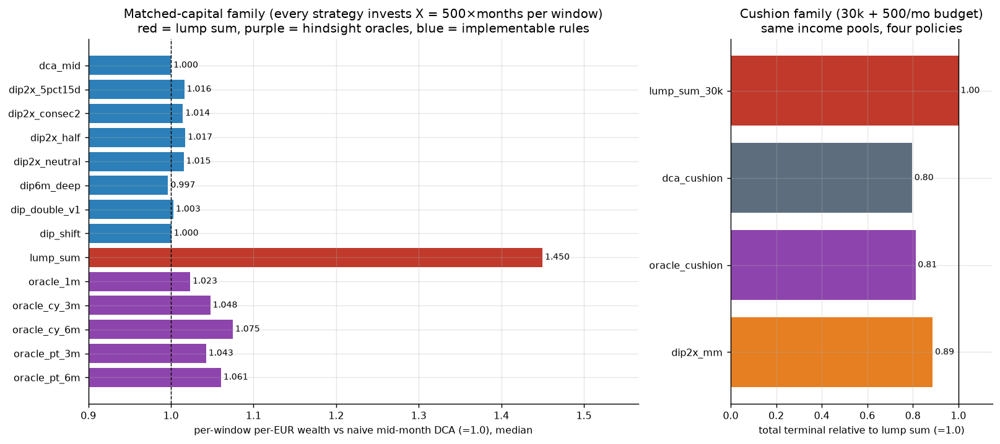

Left panel: matched-capital family, per-EUR wealth vs naive DCA (=1.0), median
across ~1,992 windows. Right panel: cushion family relative to its own lump-sum
policy (=1.0).

### 4.1 Final rankings

| Rank (per EUR of budget) | Strategy | Score | Insight |
|---|---|---:|---|
| 1 | **Lump sum (deploy everything at day 0)** | **1.450** | Nothing beats it historically — time in the market is the whole game |
| 2 | oracle_cy_6m (hindsight 6-month lows) | 1.075 | The best-case *any* dip timing could ever plausibly achieve |
| 3 | oracle_pt_6m / pt_3m / cy_3m / oracle_1m | 1.02-1.06 | Perfect monthly-low knowledge is worth only +2.3% |
| 4 | dip2x_half (best implementable rule) | 1.017 | The −3%/20d "2x on dips, half next month" rule |
| 5 | dip2x_5pct15d / consec2 | 1.014-1.016 | Same skill, less extra capital |
| 6 | dip_double_v1 / dip_shift | 1.000-1.003 | Naive dip triggers ≈ zero |
| 6 | dip6m_deep (cycle lumps) | **0.997** | Waiting for lows without foresight destroys value |
| baseline | dca_mid | 1.000 | |

(Matched-capital panel; the cushion family separately: dip2x_mm reaches 0.89 of
its lump-sum, dca_cushion 0.80, oracle_cushion 0.81.)

### 4.2 The three lessons of the whole research program

1. **Time in the market dominates**: with matched amounts, lump sum is +45%
   over naive DCA at the median and wins ~98-99% of windows. Nothing timing-based
   closes more than a fifth of that gap.
2. **Hindsight and implementable rules are different universes**: perfect dip
   knowledge buys +2-7.5%; the best implementable trigger (−3%/20d or −5%/15d,
   2x with next-month haircut) buys +1.7% (+3.4% on pure stocks); naive
   trigger variants buy ~0; cycle-lump waiting without foresight is negative.
3. **Capital structure beats timing**: the one implementable rule that made a
   real difference (+6-17% vs parked-cash DCA) worked by *reallocating capital
   at drawdowns*, not by shaving timing noise. If you must hold a 30k buffer,
   harvesting it into equities during drawdowns is worth 10x any buy-timing
   cleverness — though it costs you the liquidity the buffer exists for.

### 4.3 Practical guidance for the EUR saver

- Max wealth, history's verdict: invest the reserve at day 0 and DCA your salary
  on arrival. Cash has cost ~16-18% of terminal wealth over 10-20y windows.
- Compromise with liquidity in mind: classic 500/mo DCA + a dip-harvested
  buffer (dip2x_mm) lands −9.8% vs full lump sum but keeps the reserve early on
  (when it matters) and consumption later (when the portfolio is large).
- Intra-month precision is noise: buying "the perfect day of the month" is worth
  ~+2% at best, ~0% with realistic information.

---

## 5. What if the lump sum deploys INTO a bear market (2008-09)?

All previous tables pool all 498 windows. This section isolates the scenario you're
worried about: the whole lump is invested during the 2008-09 bear. The per-window
records split every comparison by *when the window starts*.

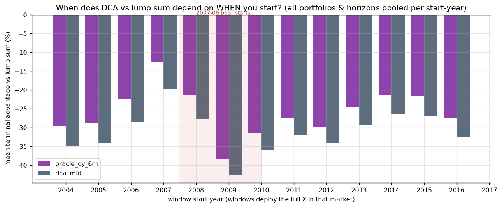

### 5.1 DCA vs LS by window start year (mean, all portfolios pooled)

| start year | 2004 | 2005 | 2006 | 2007 | 2008 | 2009 | 2010-2016 |
|---|---:|---:|---:|---:|---:|---:|---:|
| dca_mid vs LS | -35% | -34% | -28% | **-20%** | **-28%** | **-43%** | -26..-36% |
| oracle_cy_6m vs LS | -29% | -29% | -22% | -13% | -21% | -38% | -21..-32% |

- **2009 starts are DCA's worst cohort** (-43%): LS deploys at the generational
  bottom, then compounds a monster recovery on the full amount; DCA spreads over
  100 months and misses most of it.
- 2007 starts (the pre-crash top!) are DCA's *best* cohort (-20%).

### 5.2 Splitting by luck: how bad did the entry look?

Max drawdown of the composite in the first 12 months after day 0 (stocks_100, all
pooled windows):

| LS entry outcome | n | dca vs LS (mean) | DCA win rate |
|---|---:|---:|---:|
| no crash within 1y (dd < 10%) | 145 | -36% | 0% |
| mild crash (10-25%) | 277 | -34% | 1.8% |
| **severe crash (dd ≥ 25%)** | 76 | **-23%** | **5.3%** |

Extreme case: the five worst LS entries (DD ~55% within a year — starting right
at the GFC cliff, 2008-04/05) still end **-2.7% to -19% behind DCA**, not ahead of
it. And the exact 9 windows out of 1,992 where naive DCA finally beats LS are ALL
10y windows starting May 2007 → Jan 2008: LS deployed at the cyclical top, DCA
bought the whole bear, +0.1% to +6.7%.

### 5.3 Why deploying into a bear does not rescue DCA

With 10-20y horizons the crash itself is small in compounding terms: LS holds a
*fully deployed* portfolio through the recovery, DCA spends ~half its horizon
deploying. The scenario where DCA's insurance actually pays is a window that
**ends** in a bear (the 2000-2010 lost decade) — structurally absent from a 2004+
sample for long horizons. In the crash-era cohort, the only strategy that
meaningfully exploited the bear was capital reallocation, not timing:
dip2x_mm (DB buffer harvested into dips) cut its gap to lump sum from -22%
(parked cushion) to **-11%** (and to −1% in the 2008-07 anchor window).

**Bottom line**: buying a 55% crash at the start of a 10-20y window is recoverable
(−21% DCA-disadvantage instead of −36%); buying the bottom is disaster for DCA;
DCA beats LS only when the LS entry is the *last* cyclical top before the
bear — 9 windows in this sample.


## 6. Hybrid LS/DCA splits (staged windfall)

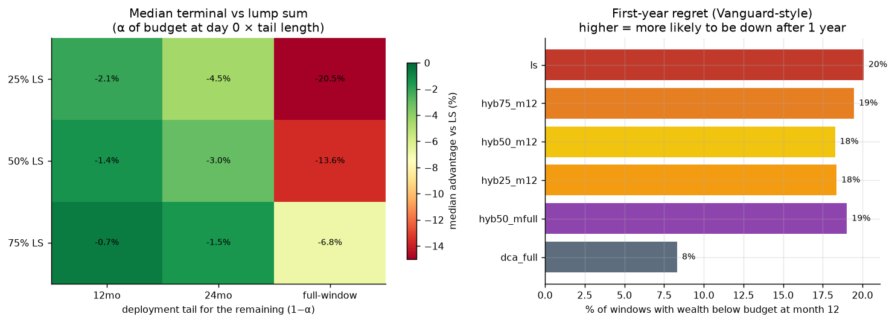

Budget X = 500 × months available at day 0; α invested immediately, (1−α) over a
tail of M months in the MMF. Pooled (baseline ls):

| Strategy | median | adv mean vs LS | win vs LS | down at month 12 |
|---|---:|---:|---:|---:|
| ls | 190,301 | +0.0% | - | 20% |
| hyb50_m12 | 189,061 | **-0.4%** | 24% | 18% |
| hyb75_m12 | 189,435 | -0.2% | 24% | 19% |
| hyb50_m24 | 185,363 | -1.2% | 26% | 19% |
| hyb50_mfull | 163,020 | -13.6% | 1% | 19% |
| dca_full | 133,572 | -27.3% | 1% | **8%** |

A 12-month tail costs almost nothing (-0.4% mean, Vanguard-consistent) and
still loses 3 of 4 windows; long tails pay the full cash drag. A dip-accelerated
full tail (`hyb50_full_dip`, -9.3% mean) recovers ~4pp of the long-tail drag.
Detail: `hybrid_split.md`.

## 7. Cash is king: waiting for a crash (windfall in MMF, deploy on drawdown)

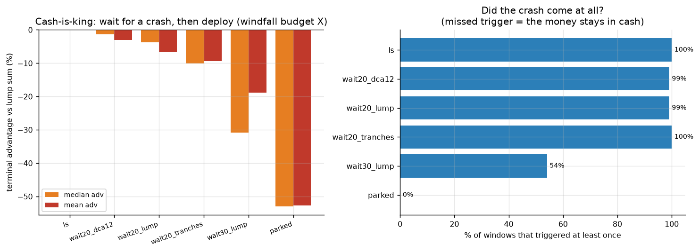

Trigger: first day ≥20% (or 30%) below the trailing 2-year high; no lookahead.
Pooled (baseline ls): `wait20_dca12` -1.3% median / -3.1% mean / **49% win**;
`wait20_lump` -3.8% / -6.7%; `wait30_lump` -30.9% median but never triggers in
**46%** of windows; `parked` -52.9%.

**The pure-stock exception:** on stocks_100, `wait20_dca12` *beats* lump sum —
**+11.0% median, +9.3% mean, 59% win** — the only strategy in the whole program
to beat LS on the mean. Balanced portfolios lose (drawdowns too shallow, cash
drag dominates). Detail: `crash_deploy.md`.

## 8. Deep history 1926+ (US stocks, open data)

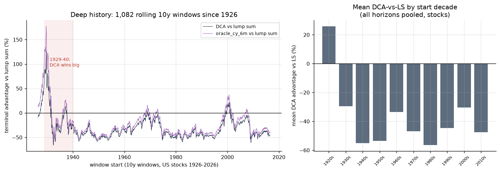

Ken French daily factors (Mkt-RF+RF, RF) from 1926-07 + FRED DGS10 synthesized
10y bond TR from 1962. stocks_100, 1,082 ten-year windows:

| Horizon | LS median | dca adv med | dca win | oracle_cy_6m adv med |
|---|---:|---:|---:|---:|
| 10y | 171,136 | -38.6% | 8% | -32.4% |
| 20y | 930,885 | -56.1% | 4% | -51.5% |

The deep sample is **worse for DCA on the median** (-38.6% vs -31% modern) but
**better in the tail**: DCA win frequency rises 0.5% → 8%, and 388 windows flip
to DCA — nearly all starting 1929-01…1930-09, where DCA beat LS-at-the-top by
+50% to +127%. This finally supplies the lost-decade scenario the 2004+ sample
lacks. Detail: `deep_history.md`.

## 9. Updated synthesis (eight studies)

1. **Time in the market remains dominant**: LS wins ~99% of windows in the
   modern sample, ~92% since 1926 — and beats every implementable timing or
   staging rule on the mean *except one*.
2. **One implementable rule beat LS on the mean — conditionally**: "wait for a
   -20% drawdown, then DCA over 12 months" on 100% US stocks (+9.3% mean, 59%
   win). It fails on balanced portfolios and depends on the 2004-2026 regime of
   frequent V-shaped recoveries; the deep-history sample is the right stress
   test before trusting it.
3. **Staging costs little, regret falls slowly**: 12-month tails cost ~0.4-2%
   mean and only shave 1-2pp off first-year regret; full-window DCA cuts regret
   to 8% but costs 27%.
4. **Timing precision is noise; capital and crashes are signal**: perfect
   monthly dip knowledge is +2.3%; a real crash-drawdown trigger is worth +9%
   on stocks *because it changes capital allocation*, not because it times
   within a month.
5. **The honest summary for a EUR saver**: invest windfalls immediately (or
   stage at most 12 months); keep salary DCA running; if you must hold a cash
   buffer, harvest it into drawdowns; and the only scenario where DCA truly
   wins is starting at a cyclical top like 1929 — which you cannot know in
   advance.

## Reproduce

```bash
uv run python -m backtesting.mm_cushion --reuse-cache      # cushion study
uv run python -m backtesting.dip_dca --reuse-cache         # dip-rule study
uv run python -m backtesting.dca_vs_lumpsum --reuse-cache  # LS-vs-DCA study
uv run python -m backtesting.research_plots                # regenerate all figures
uv run python -m unittest discover -s backtesting/tests -v
```

JSON artifacts (gitignored): `backtesting/data/{dca_vs_lumpsum,dip_dca,mm_cushion}.json`.
Figures regenerate into `research/plots/`.

## Caveats

- Rolling windows overlap heavily; 498 windows ≠ 498 independent observations.
- Oracle rows use perfect hindsight by design (upper bounds). All dip rules are
  implementable: decisions use only information up to the current day.
- Sample 2004-2026 contains one macro regime, dominated by equity bull markets —
  this flatters lump sum vs longer-historical studies (~2/3 win rate there).
- Economics: total-return (accumulation-equivalent) ETF data; no FX (nominal USD,
  EUR labels), no TER/taxes; MMF reserve = T-bill proxy for XEON.
